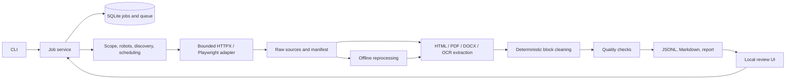

# SitePrep

A local website collection and cleaning application built from
`CODEX_CRAWLING_CLEANING_PLAN.md`. It saves raw evidence, discovers in-scope links,
extracts ordered source blocks and exports reviewable, source-linked documents.
There is no chatbot or commercial API dependency.

## Install

Tested with Python **3.12.11**, macOS arm64, Chromium supplied by Playwright **1.63.0**
and Tesseract **5.5.3**. Exact Python dependency versions are in `uv.lock`.

```sh
uv sync --locked
uv run playwright install chromium
brew install tesseract                  # macOS
# Debian/Ubuntu: sudo apt-get install tesseract-ocr
# Linux browser libraries: uv run playwright install --with-deps chromium
```

PDF rendering uses local PDFium (`pypdfium2`), so Poppler and LibreOffice are not
required. Tesseract's English language data is the default; install additional
language packs before changing `ocr_language`. Without Tesseract, native HTML/PDF/
DOCX still work and OCR-dependent records are marked for review.

The installed project works through `uv run`, or activate `.venv` and use `python`.
Keep the virtual environment out of version control. Do not copy it between machines.

## Run

```sh
uv run python -m siteprep crawl https://example.com --config config.example.yaml
uv run python -m siteprep list
uv run python -m siteprep report --job JOB_ID
uv run python -m siteprep cancel --job JOB_ID
uv run python -m siteprep resume --job JOB_ID
uv run python -m siteprep reprocess --job JOB_ID
uv run python -m siteprep reprocess --job JOB_ID --config config.example.yaml
uv run python -m siteprep ui
```

The review UI is local at **http://127.0.0.1:8501**. It supports URL/scope/limit entry,
background collection, cancellation, progress, outcomes, source/cleaned inspection,
quality flags, offline reprocessing and ZIP downloads. CLI and UI share `JobService`.

To create a durable job without starting it:

```sh
uv run python -m siteprep create https://example.com
uv run python -m siteprep run --job JOB_ID
```

Global options precede the command: `python -m siteprep --data-dir /path/to/jobs list`.
`crawl` prints its job ID to stderr and a JSON report to stdout. A partial crawl is a
valid report, not a crash; read `status`, `termination_reason`, flags and pending URLs.
Use `cancel` from a second terminal to stop an active CLI job. Use `resume` after a
worker crash; it refuses to take ownership from a live worker.

## Configuration

Start with [config.example.yaml](config.example.yaml). Unknown keys and invalid limits
are rejected. All supported settings and constraints are defined in
[siteprep/config.py](siteprep/config.py).

* Empty `allowed_domains` means the exact seed hostname. Subdomains are not implicit.
* `allowed_paths` uses path boundaries; `/help` does not include `/helpful`.
* `external_document_domains` adds explicit PDF/DOCX hosts.
* `browser_resource_domains` adds explicit hosts for browser script/API resources.
  The UI exposes this as **Browser resource hosts**. These hosts still undergo
  destination and robots checks.
* Queries that identify content are retained. Common tracking parameters are removed.
* Hash routes are flagged by default; set `hash_routes: follow` to schedule routes.
* `max_resources`, depth, discovery, sitemap, query-variant, byte, time and OCR caps
  control resource use. They are not knowledge-completeness thresholds.
* `render: auto` uses JS evidence; `always` and `never` are per-job overrides.
  Rendering waits for active request chains to settle within `timeout_seconds`
  (UI: **Request / render timeout**). An unavailable dependency can still leave
  an incomplete page; inspect browser warnings and the saved rendered source.
* `manual_image_urls` includes informative images missed by heuristics.
* `remove_selectors` provides optional CSS-based cleaning overrides.
* No setting permits arbitrary private network access.

Requests identify as SitePrep, respect robots and throttle each host. Retries apply
to transient failures/rate limits, with `Retry-After` bounded by the job budget.
Authentication, CAPTCHA solving, forms and access-control bypass are out of scope.
Malformed sitemaps, including sites returning their HTML homepage at `/sitemap.xml`,
produce discovery warnings and do not prevent the seed page from being collected.

## Outputs

Each job is isolated under `.siteprep/JOB_ID/`:

```text
raw/                 original bodies, compressed entity bytes when applicable, rendered HTML
manifest.json        resource states and source metadata/hashes
attempts.json        transfer/retry/control/render history
documents.jsonl      every extracted record, with explicit status
ready.jsonl          records without raised quality flags
review.jsonl         needs_review, empty and unsupported records
markdown/            human-readable documents with source and block labels
crawl_report.json    counts, skips, failures, limits, warnings and termination reason
```

A valid download with weak extraction stays available for review. Offline reprocessing
uses saved source bytes and cannot discover missing network resources. It records the
new extraction configuration without rewriting the historical crawl configuration.

See the [schema](docs/schema.md), [design decisions](docs/design-decisions.md),
[limitations](docs/limitations.md), [evaluation](docs/evaluation.md), and
[third-party notices](THIRD_PARTY_NOTICES.md).

## Test and reproduce the fixture example

```sh
uv run pytest -q
uv run ruff check siteprep tests scripts
uv run python -m scripts.evaluate
# Explicit optional public network evaluation (small, throttled samples):
uv run python -m scripts.evaluate --public
```

Tests start an ephemeral fixture server with access restricted to its exact loopback
origin. Public settings reject the same URLs. Fixtures cover query variants, sitemap
indexes, source facts, FAQ/list/table structure, native/mixed/scanned PDFs, DOCX,
image OCR, JavaScript, robots, failures, retries, byte/time caps and cancellation.
The checked-in [fixture output](examples/fixture-job/crawl_report.json) and
[fact checklist](examples/fixture-evaluation.json) are real generated results.

## Troubleshooting

* No documents / HTTP 403: a site may return an anti-bot verification page instead of
  content. The interface shows the access failure and saved response, including for
  older jobs. NUST's homepage returned this response in the observed September 19,
  2026 runs. Increasing limits, rendering settings or reprocessing that response does
  not recover missing content; site-owner allowlisting or an accessible export is needed.
* Browser executable missing: rerun `uv run playwright install chromium`.
* OCR unavailable: verify `tesseract --version` and `tesseract --list-langs`.
* A page is missing JS content: inspect raw HTML/flags, then try `render: always` in a
  new job; configure only the required external script hosts.
* `robots_denied`: inspect the saved robots source/report; the collector does not
  bypass the policy.
* `private_destination`: localhost, private IPs and mixed public/private DNS answers
  are intentionally rejected outside the fixture harness.
* `partial`: inspect pending URLs and specific warnings. Increase appropriate limits
  in a new job if more coverage is needed. Do not assume larger counts prove completeness.
* Parser/worker error: the raw source and reason remain. Correct settings and reprocess;
  one resource failure does not discard the job.

## Architecture and original work



Our original code owns job state, crawl policy/queue, safety checks, recovery,
extraction orchestration and block rules, cleaning, quality, exports and UI. Libraries
supply parsers, HTTP/browser execution and OCR. Scrapling 0.4.15 was evaluated and
acknowledged; concrete adapter incompatibilities led to the fallback expressly allowed
by the plan. No crawler template or site-to-Markdown application was copied. The
optional `evaluation` dependency group retains the evaluated release for reproducibility.
